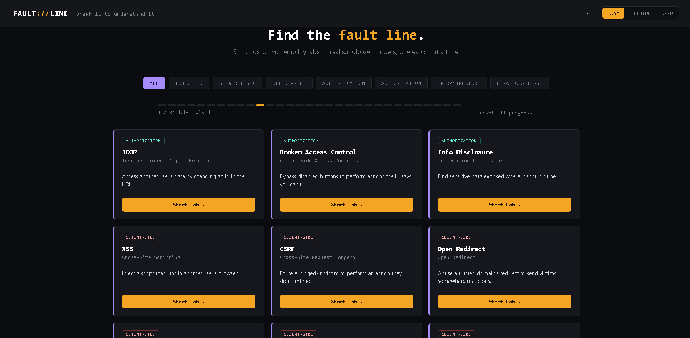

<div align="center">

# Faultline

**Break it to understand it.**

87 hands-on, intentionally vulnerable web security labs — real sandboxed
target apps, one exploit at a time.



`Node.js 18+` · `Easy / Medium / Hard` · `Dark & Light mode` · `Zero cloud, all local`

</div>

---

> [!WARNING]
> **This app is deliberately insecure.** Every bug here is intentional and
> exists to teach. Run it only on `localhost` or in an isolated sandbox/VM
> — never deploy it publicly or reuse this code in a real product.
> Risky-sounding techniques (file reads, "command execution", SSRF) are all
> simulated against fake in-memory data, so nothing touches your real
> filesystem or makes real outbound requests. Details in
> [How the sandboxing works](#how-the-sandboxing-works).

## Quick start

```bash
cd web-hacking-labs
npm install
npm start        # or: npm run dev — both do the same thing
```

Open **http://localhost:3000** in a desktop browser. That's it — no
database, no config, no account to create.

## What makes this different

| | |
|---|---|
| 🎯 **Real standalone targets** | Each lab's "Lab" tab opens an actual vulnerable app in a new tab — its own login flow, its own URL you edit directly in the address bar. Not a simulated console. |
| 🔀 **Genuinely different payloads per tier** | The exploit that works on Easy is verified to *fail* on Medium and Hard. See [How the difficulty tiers work](#how-the-difficulty-tiers-work) for the audit. |
| 🚩 **Real flag verification** | Each session gets a unique, server-issued flag per lab+difficulty, only revealed when the exploit *actually* succeeds. Guessing or replaying an old flag correctly fails. |
| 📋 **Per-severity reports** | The Report tab's Summary, Reproduction Steps, and Impact are genuinely different text per tier — not one card reused three times. |
| 🧩 **Config-driven registry** | Every lab is one object in `public/js/labs-data.js` — id, category, goal, hints, per-tier reports, and an `inputContext` field (URL param / JSON body / cookie / header / hidden field / API endpoint...). No hardcoded UI per lab. |
| ⛓ **Real attack chains** | Session Fixation is a genuine 3-step chain (fix → victim logs in → reuse). Final combines two labs. Exposed Dev Endpoint and Source Map Leakage both chain through a second discovery step. |
| 🏢 **One connected fake company** | Every lab page links back to a shared "SecureCorp Intranet" hub (`/company`) with Dashboard, Profile, Support, Billing, Admin, and API tiles. |
| ↺ **Reset anytime** | Wipe a single lab's demo data and solved status to practice it again from scratch. |
| 🌓 **Dark / Light / System** | Appearance toggle in the header, saved across visits. |
| 🔍 **Search** | Filter all 89 labs by name, description, input context, or category from the homepage. |

## The labs

> 26 of the 72 labs were added after auditing Faultline's coverage against
> bWAPP's full lab list — only genuinely distinct techniques not already
> covered were added (no reskins/duplicates of existing labs). A handful of
> bWAPP entries were deliberately left out: pure binary/kernel exploitation
> (buffer overflows, local privilege escalation), protocol-level TLS bugs
> that need a real TLS stack to demonstrate honestly (BEAST/CRIME/POODLE,
> SSL 2.0), and pure network-layer DoS — none of these fit a web-app,
> flag-based training format. Heartbleed, Shellshock, Drupageddon, and
> PHP-CGI RCE are included but clearly marked ⚠️ **SIMULATED**, since they
> depend on a real vulnerable TLS/Bash/Drupal/PHP-CGI stack that can't
> exist inside this sandbox — each reproduces the real bug's request/response
> *logic* against fake in-memory data only.

<table>
<tr><th align="left">Category</th><th align="left">Labs</th></tr>
<tr><td><b>Injection</b></td><td>SQL Injection <sub>(real SQLite)</sub>, NoSQL Injection, Command Injection, SSTI, XXE, LDAP Injection, CRLF Injection, HTTP Parameter Pollution, Host Header Injection, HTML Injection, Mail Header Injection, Code Injection, Blind Command Injection, XPath Injection, Blind SQL Injection, SSI Injection</td></tr>
<tr><td><b>Server-Side Logic</b></td><td>SSRF, Insecure File Upload, Path Traversal, LFI, Cache Poisoning, Cache Deception, Request Smuggling, Secondary Context, Race Conditions, Remote File Inclusion (RFI), CORS Misconfiguration</td></tr>
<tr><td><b>Client-Side</b></td><td>XSS, CSRF, Open Redirect, Client-Side Template Injection, postMessage, Prototype Pollution, DOM-Based XSS, XSS via HTTP Headers, Clickjacking, Client-Side Validation Bypass</td></tr>
<tr><td><b>Authentication</b></td><td>2FA Bypass, Weak Password Checks, Brute Force Attack, Session Fixation, JWT Vulnerabilities, Password Reset Issues, OAuth Misconfiguration, SAML Vulnerabilities, CAPTCHA Bypass, Insecure Session Cookie Attributes, Session ID in URL, Predictable Session Token, Broken Logout</td></tr>
<tr><td><b>Authorization</b></td><td>IDOR, Broken Access Control, Vertical Privilege Escalation, Multi-Tenant Isolation Bypass, Information Disclosure, HTTP Verb Tampering</td></tr>
<tr><td><b>Infrastructure</b></td><td>Cloud Storage Misconfiguration, Subdomain Takeover, Source Map Leakage, Exposed Dev Endpoint, Web Storage Secrets, Base64-Encoded Secrets, Heartbleed <sub>(simulated)</sub>, Shellshock <sub>(simulated)</sub>, Drupageddon <sub>(simulated)</sub>, PHP-CGI RCE <sub>(simulated)</sub>, Cross-Site Tracing (XST)</td></tr>
<tr><td><b>API Security</b></td><td>GraphQL Schema Introspection <sub>(real graphql-js)</sub>, GraphQL BOLA, GraphQL Excessive Data Exposure, Missing WebSocket Auth, Cross-Site WebSocket Hijacking, Mass Assignment</td></tr>
<tr><td><b>Business Logic</b></td><td>Price & Quantity Tampering, Coupon & Discount Abuse, Multi-Step Workflow Bypass, Refund Abuse, Referral/Invitation Abuse, Account Linking Abuse</td></tr>
<tr><td><b>Attack Chains</b></td><td>Support Portal Takeover <sub>(info disclosure → weak creds → IDOR)</sub>, Internal Network Pivot <sub>(SSRF → leaked key → admin API)</sub>, Stored XSS to Admin Wire Approval <sub>(stored XSS → hijacked admin session → sensitive action)</sub> — each locked until its specific prerequisite labs are solved</td></tr>
<tr><td><b>Web Enumeration</b></td><td>Files & Directories, Virtual Host Enumeration, Fuzzing & HTTP Parameters, DNS Zone Transfer</td></tr>
<tr><td><b>Final</b></td><td>Chained challenge — Broken Access Control → IDOR</td></tr>
</table>

## How it works

**1. Pick a lab and a difficulty.** The Easy/Medium/Hard toggle in the
header applies globally and changes real server-side behavior, not just
the hint text.

**2. Read the Goal tab**, then hit **Open Live Lab** — this opens the real
vulnerable app in a new tab with its own URL you can edit directly.

**3. Exploit it.** Stuck? The Exploit tab has a hint button and a full
step-by-step solution.

**4. Submit the flag.** A `FLAG{...}` appears in the vulnerable app's
response the moment your exploit genuinely works. Paste it into the Report
tab to mark the lab solved.

**5. Practice again anytime** with **↺ Reset this lab**, which wipes that
lab's demo data and issues a fresh flag.

### How the difficulty tiers work

<details>
<summary><b>Expand for the tier-by-tier breakdown</b></summary>

<br>

Every tier was audited so the easier technique genuinely stops working a
tier up — not just harder in theory. A few examples:

| Lab | Easy → Medium → Hard |
|---|---|
| **XSS** | `<script>` → blocked, use `onerror=` → blocked, use `autofocus`+`onfocus` |
| **Path Traversal / LFI** | plain `../` → blocked, use `....//` → blocked, use double URL-encoding |
| **SQL Injection** | login unescaped → password field escaped only → login fully safe, but department search is UNION-injectable |
| **CSRF** | no protection → shallow `Origin` check (still bypassed) → blocks img/fetch but a real link click still works |
| **SSRF** | literal internal IPs → blocked, use hex/decimal encoding → blocked, chain through a "trusted" redirector |
| **Cache Poisoning** | unkeyed param is `utm_source` → fixed, but `ref` is unkeyed → fixed, but `lang` is unkeyed |
| **Prototype Pollution** | no denylist → blocks `__proto__` (bypassed via `constructor.prototype`) → blocks all three keys — **honestly not exploitable**, a real fix |
| **Subdomain Takeover** | dangling domain is `old-blog` → doesn't exist, it's `beta` instead → doesn't exist, it's `archive` instead |
| **Brute Force** | error message reveals valid usernames → response-timing side channel → account-lockout side channel |
| **NoSQL Injection** | `{"$ne":""}` → blocked, use `$gt` → blocked, use `$regex` |
| **JWT** | `alg:none` accepted → blocked, weak guessable secret → strong secret, but RS256/HS256 algorithm confusion |
| **HTTP Parameter Pollution** | duplicate query param (validate-first/apply-last) → query fixed, but a JSON body override has zero validation → JSON body fixed, but a JSON *array* value reintroduces validate-first/apply-last |
| **Vertical Privilege Escalation** | hidden `role` field trusted directly → field ignored, but a leftover `X-Role-Override` debug header isn't → both fixed, but a secondary "bulk update" endpoint still has the bug |
| **Multi-Tenant Isolation** | no ownership check at all → a plain, editable cookie gates it → a "signed" header that's actually just the tenant id reversed |

One honest caveat: a couple of labs (Client-Side Template Injection,
postMessage's origin-check gap) have a core mechanic that's identical by
nature across tiers. Those say so explicitly in their Goal tab rather than
faking a difference.

</details>

### How the sandboxing works

<details>
<summary><b>Expand for what's real vs. simulated</b></summary>

<br>

| Technique | What actually happens |
|---|---|
| SQL Injection | **Real** — an in-memory SQLite database via `sql.js`, seeded with fake rows |
| GraphQL labs | **Real** — an actual `graphql-js` schema/execution engine; introspection, validation errors, and "Did you mean" suggestions all behave exactly like a genuine target |
| WebSocket labs | **Real** — a real `ws` server attached to the same HTTP server, real handshakes, real Origin headers |
| Command Injection | **Simulated** — pattern-matched and answered with canned fake output; never calls a real shell |
| Path Traversal / LFI / XXE | **Simulated** — resolves against a fake in-memory "filesystem" in `routes/vuln-common.js`, never touches your real disk |
| SSRF | **Simulated** — pattern-matched against a fake list of "internal services"; no real outbound network request is ever made |
| File Upload | **Real upload**, immediately deleted after inspection; never written anywhere web-accessible or executed |
| Everything else | Real Express routes, real session/cookie/header logic — the actual bug class, just with fake demo data |

</details>

### 📁 Project structure

<details>
<summary><b>Expand for the file layout</b></summary>

<br>

```
web-hacking-labs/
├── server.js                    Express entrypoint, mounts every route module
├── routes/
│   ├── vuln-common.js           Session store, fake filesystem, fake internal services, page shell, flag system
│   ├── vulns-authz.js           IDOR · Broken Access Control · Vertical Privesc · Multi-Tenant Isolation ·
│   │                            HTTP Verb Tampering · Final Challenge
│   ├── vulns-clientside.js      XSS · CSRF · Open Redirect · CSTI · postMessage · Prototype Pollution ·
│   │                            DOM-Based XSS · XSS via HTTP Headers · Clickjacking · Client-Side Validation Bypass
│   ├── vulns-injection.js       SQLi · NoSQL · Command Injection · SSTI · XXE · LDAP · CRLF · HTTP Param Pollution ·
│   │                            Host Header · HTML Injection · Mail Header Injection · Code Injection ·
│   │                            Blind Command Injection · XPath Injection · Blind SQL Injection · SSI Injection
│   ├── vulns-serverlogic.js     SSRF · File Upload · Path Traversal · LFI · Cache Poisoning/Deception ·
│   │                            Request Smuggling · Secondary Context · Race Conditions · RFI · CORS Misconfiguration
│   ├── vulns-auth.js            2FA Bypass · Weak Password · Brute Force · Session Fixation · JWT ·
│   │                            Password Reset · OAuth · SAML · CAPTCHA Bypass · Insecure Cookie Flags ·
│   │                            Session ID in URL · Predictable Session Token · Broken Logout
│   ├── vulns-infra.js           Info Disclosure · Cloud Storage Misconfig · Subdomain Takeover ·
│   │                            Source Map Leakage · Exposed Dev Endpoint · Web Storage Secrets ·
│   │                            Base64 Secrets · Heartbleed/Shellshock/Drupageddon/PHP-CGI RCE (all simulated) · XST
│   ├── vulns-enum.js            Files & Directories · Virtual Hosts · Fuzzing & Parameters · DNS Zone Transfer
│   ├── vulns-api.js             GraphQL (real graphql-js) · WebSockets (real `ws`, attached to the same HTTP
│                                server) · REST Mass Assignment — see attachWebSocketServer, called from server.js
│   ├── vulns-business.js        Price/Qty Tampering · Coupon Abuse · Workflow Bypass · Refund Abuse ·
│                                Invitation Abuse · Account Linking Abuse
│   ├── vulns-chains.js          Attack Chains — 3 multi-step scenarios, each combining techniques from
│                                several other labs (locked until their specific prerequisites are solved)
│   ├── company-hub.js           /company — the fake intranet landing page tying every lab "area" together
│   └── reset-and-validate.js    POST /api/reset-lab · /api/reset-all · /api/validate-lab ·
│                                /api/confirm-client-exploit · GET /api/progress · POST /api/hint-used
│                                (all structural — work for any labId, not re-implemented per lab)
├── tools/
│   └── validate-labs.js         Lab registry validator — checks every lab's metadata, live route, and flag-issuing
│                                code path against the running app. Run with `npm run validate` (server must be up).
├── tests/
│   ├── run-all.js                The `npm test` entrypoint — boots the app, runs everything below, tears down.
│   ├── engine.test.js            Session/flag/reset/hint engine: isolation, invalidation, single-use tokens.
│   ├── api-security.test.js      GraphQL (real graphql-js), WebSockets (real `ws` client), mass assignment.
│   ├── new-labs.test.js          All 26 post-audit labs, every tier, both the blocked and bypass path.
│   └── regression.test.js        Permanent coverage for bugs caught during that audit.
├── public/
│   ├── index.html / lab.html
│   ├── css/style.css
│   └── js/
│       ├── labs-data.js         The challenge registry: every lab's goal, hints, input context, per-severity reports
│       ├── app.js               Homepage: grid, search, filters, progress
│       ├── lab.js               Lab detail page: tabs, flag submission, reset
│       └── theme.js             Dark/Light/System appearance toggle
└── README.md
```

> **Note on structure:** each `vulns-*.js` file is organized by OWASP-ish
> category (injection, client-side, auth, ...) and holds every lab in that
> category — there is deliberately no `vulns-*-new.js` proliferation. Labs
> added in later sessions are merged directly into the category file they
> belong to, verified against the full test/validator suite, and the
> merge commit removes the temporary file. `npm run validate` is the fast
> way to confirm the registry and the live app still agree with each other
> after any change.

</details>

## Progress & state

|  | Where it lives | Reset |
|---|---|---|
| **Lab progress** (solved status) | **Server-side** (per-session, in memory), cached in `localStorage` only for instant paint on load | "reset all progress" on the homepage (`POST /api/reset-all`), or per-lab from its page (`POST /api/reset-lab`) |
| **Server-side demo state** (sessions, notes, balances...) | In memory | Restarting the server, or instantly via **↺ Reset this lab** |
| **Hints used** | Server-side (per-session), exposed via `GET /api/progress` | Cleared automatically on lab reset |

> A lab can only ever be marked "solved" by the server, and only after
> `POST /api/validate-lab` (or `POST /api/confirm-client-exploit`, for the
> handful of purely client-side labs — see below) verifies a real,
> session-issued flag. There's no client-writable path to fake this from
> DevTools.
>
> **Client-side-only exploits and the flag engine.** A few labs (DOM XSS,
> postMessage, prototype pollution, client-side template injection, reading
> an insecure cookie via JS, scanning Web Storage) exploit entirely in the
> browser — there's no server request to hook a "you did it" condition
> onto. Rather than embedding the real flag in the page up front (which
> would mean the flag text exists in the HTML before you've actually solved
> anything), these labs embed a random, single-use **proof token** instead.
> Once your exploit runs, the page's own JS posts that token to
> `POST /api/confirm-client-exploit`, and only a genuine token match gets
> the real flag back. Detection still has to happen client-side — that's
> the nature of the vulnerability class — but revelation doesn't.

## Testing

```bash
npm test          # boots the app itself, runs every suite, tears down, reports pass/fail
npm run validate   # lab-registry validator only (server must already be running)
```

`npm test` runs, in order:

1. **`tools/validate-labs.js`** — every one of the 89 labs' metadata is
   complete, its category is real, its difficulty tiers are all present,
   its route actually responds, and its flag-issuing code path exists
   under the exact id the registry expects.
2. **`tests/engine.test.js`** — the session/flag/reset engine itself:
   solving for real marks a lab solved server-side (and only that); a
   well-formed but made-up flag is rejected; reset invalidates the old
   flag and clears solved status; two independent sessions can't redeem
   each other's flags; a flag can't be replayed under the wrong
   difficulty; `reset-all` clears everything; hint usage is tracked; the
   client-proof token pattern hands back a flag only on a genuine,
   single-use confirmation.
3. **`tests/api-security.test.js`** — GraphQL introspection/BOLA/field
   exposure against a real graphql-js schema; WebSocket auth and Cross-Site
   WebSocket Hijacking using a real `ws` client; REST mass assignment.
4. **`tests/business-logic.test.js`** — price/quantity tampering, coupon
   stacking, multi-step workflow integrity, refund bounds/idempotency,
   referral-uniqueness normalization, and token/session-binding checks.
5. **`tests/chains.test.js`** — the full multi-step flow of all 3 attack
   chains, every tier: each discovery step, each auth/access step, and the
   final sensitive action, verified end to end.
6. **`tests/new-labs.test.js`** — all 26 labs added after the bWAPP audit,
   every difficulty tier, both the "blocked" and "bypass" path for each.
7. **`tests/regression.test.js`** — the specific bugs that were caught and
   fixed during that same audit, kept as permanent regression coverage.
8. **`tests/existing-labs-regression.test.js`** — loads
   `data/existing-labs-manifest.json` (the frozen record of every lab that
   exists today) and fails the build if any of them disappear, lose their
   category, or stop responding on their primary route. This is the
   mechanical enforcement of "never remove an existing lab" — see
   [`docs/UPGRADE-LOG.md`](docs/UPGRADE-LOG.md) for why it exists.
9. **`tests/route-collisions.test.js`** — fails if the same HTTP
   method+path is ever registered by more than one route file wired into
   `server.js`. Pure static analysis, no server required.
10. **`tests/session-engine.test.js`** and **`tests/lab-metadata.test.js`**
    — added in the Phase 1 architecture pass. Cover the session store's
    TTL/cleanup/capacity behavior, and the centralized `tags`/
    `successCondition` lab metadata plus referential integrity of the
    existing chain `prerequisites` field.

921 assertions today. Add a lab, and the validator will tell you
immediately if you forgot a difficulty tier or a flag call before you
ever open a browser. After adding or restructuring labs, run
`node tools/generate-manifest.js` to re-baseline the compatibility
manifest — see `docs/UPGRADE-LOG.md` for the full phase-by-phase history
of what's been added and why.

11. **`tests/target-realism.test.js`** — added in the Phase 2a realism
    pass. Locks in the fix that removed a literal `difficulty: X` /
    `sandbox` label from the shared target-app topbar and CTF-adjacent
    language from the `/company` intranet hub's own copy.
12. **`tests/csp-bypass.test.js`** — added in the Phase 3a lab-growth
    pass. Full coverage for the new `csp-bypass` lab: real CSP header
    correctness per tier, the nonce-non-rotation bug itself, and the
    client-proof-token issue/confirm/replay/reset lifecycle.
13. **`tests/ssrf-isolation.test.js`**, **`tests/filesystem-isolation.test.js`**,
    **`tests/command-isolation.test.js`** — added in the Phase 6 isolation
    pass. Each combines static source analysis (grepping for the real
    modules — `http`/`https`/`net`/`dns`/`fs`/`child_process` — that would
    be required to escape the simulation) with live dynamic fuzzing against
    real host-system telltales, proving SSRF/path-traversal/LFI/command-
    injection labs cannot reach anything real.
14. **`tests/report-engine.test.js`** — added in the Phase 5 reporting
    pass. Covers the report-scoring rubric, the real-flag-verification
    requirement on the Evidence field, listing/filtering, reset-survival,
    and session isolation.
15. **`tests/chain-engine.test.js`** — added in the Phase 4 chain
    state-machine pass. Covers the engine's pure state-machine logic
    (never regresses, safe no-ops on unknown states/chains) plus a
    transition-by-transition walk through all 3 real chains, including
    negative cases that must NOT advance state.
16. **`tests/shopsphere.test.js`** — added in the Phase 2b pass. Confirms
    the 4 re-skinned checkout-flow labs show real ShopSphere branding,
    confirms the 2 deliberately-untouched labs still show SecureCorp
    branding, and re-runs 2 of the actual exploits through the API to
    prove the re-skin never touched the vulnerable logic itself.
17. **`tests/websocket-chat-hijack.test.js`** — added in the Phase 3b
    pass. Full `ws`-client coverage of all 3 tiers of the new
    `websocket-chat-hijack` lab, including the room-namespacing fix and
    confirming the hard-tier role-escalation flaw doesn't exist at
    easy/medium.
18. **`tests/difficulty-guard.test.js`** — added in the Phase 7 audit
    pass. Confirms `expert`/garbage difficulty values get proper 501/400
    errors instead of silently running as easy tier, and — since this is
    global middleware in front of every `/vuln/*` route — that ordinary
    requests across multiple labs and tiers are completely unaffected.
19. **`tests/ssrf-expert-tier.test.js`** — added in the Phase 7 second
    pass (genuine Expert-tier content for `ssrf`). Checks all 4 tier
    behaviors explicitly: both hard-tier bypasses closed, the new
    IPv6-representation bypass open, and hard tier itself provably
    unchanged.
20. **`tests/jwt-expert-tier.test.js`** — added in the Phase 7 third pass
    (genuine Expert-tier content for `jwt-vulnerabilities`). Builds real
    HMAC-SHA256 tokens with Node's own `crypto` module and confirms all 4
    tiers behave correctly, including that the role check still applies
    on top of the kid-injection signature bypass.
21. **`tests/finova.test.js`** — added in the Phase 2c pass (Finova, the
    third target application). Confirms branding, no CTF-language leaks,
    and that the actual invitation-abuse exploit still works post-re-skin.
22. **`tests/sql-injection-expert-tier.test.js`** — added in the Phase 7
    fourth pass. Covers second-order SQL injection: storage is genuinely
    safe, the vulnerability only fires on a later reuse of the stored
    value, and a benign note through the same path leaks nothing.
23. **`tests/xxe-expert-tier.test.js`** — added in the Phase 7 fifth
    pass. Covers blind/OOB XXE, including verifying the endpoint is
    truly blind (identical response for a failed vs. inert payload, not
    just "no flag") and that exfiltration is session-scoped.
24. **`tests/graphql-expert-tier.test.js`** — added in the Phase 7 sixth
    pass. Covers alias-based GraphQL batching authorization bypass,
    including a reversed-alias-order test proving the bug is genuinely
    "only the first occurrence is checked" and explicit regression checks
    on introspection blocking / the sensitive-field AST check (both
    needed updating alongside this work and would have silently regressed
    otherwise).
25. **`tests/idor-expert-tier.test.js`** — added in the Phase 7 seventh
    pass. Covers bulk-export IDOR: a newly-introduced single-record
    ownership check plus a bulk endpoint that bypasses it, checked
    directly against the underlying API endpoint, not just the page.
26. **`tests/discovery.test.js`** — added in the Phase 2d pass. Confirms
    `/robots.txt`, `/sitemap.xml`, and `/api-docs` exist, are correctly
    content-typed, and — notably — that every URL the sitemap lists
    actually resolves, not just that the XML is well-formed.

1383 assertions today (89 labs, 6 with genuine Expert-tier content;
verified via repeated full clean-slate test runs, not just one). See
`docs/UPGRADE-LOG.md` for the complete phase-by-phase history of what's
been added and why — including an honest writeup of a real (not
false-alarm) flaky-test bug found and fixed in the same session.

## Disclaimer

For legal, hands-on security education only. Do not use any technique
learned here against systems you don't own or have explicit written
permission to test.
